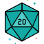
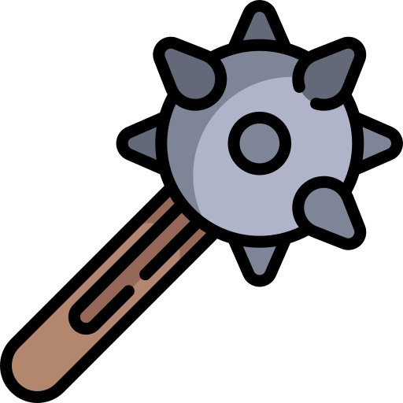

#  Stephanie Stralina

As a Junior Software Engineer with a background in full stack development, entrepreneurship, and content creation - 
I thrive when I’m synthesizing complex information and transforming it into intuitive, user-friendly solutions. 
My unique mix of technical skills, teaching experience, and business mindset makes me a
highly adaptable, driven, and creative problem-solver who can bridge technical skills with human understanding.

I also talk about Dungeons & Dragons a lot. Like - a LOT.

---

###  Languages, Frameworks & Tools

                  

---
###  Get in touch

 
<a href="https://www.linkedin.com/in/stephaniestralina/" style="color:#149A92;">Message me on Linkedin
</a> 

</a> 
<a href="mailto:StephanieDRichter@gmail.com" style="color:#149A92;">Email me at StephanieDRichter@gmail.com
</a> 